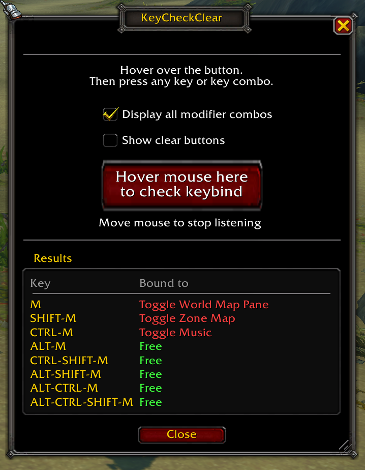

# KeyCheckClear

Press a key or key combo to see what it's bound to. You can optionally clear the keybind with one click (undo is available also).

WoW's keybinding screen works fine to bind to an addon or internal function. KeyCheckClear works from the other angle. Is this key available? So this addon is handy when you're looking for a free key, or trying to figure out why a key does something you didn't expect. "Why are my macro modifiers not working? What is SHIFT+F12 bound to anyway?"

## Using it

Open the window with `/kcc` or with the minimap button. Hover the mouse over the big button and press a key or key combo. Mouse buttons 3-5 and the mouse wheel work too. Move the mouse off the button to stop listening.

- **Display all modifier combos** shows the key with every modifier: no modifier, Shift, Ctrl, Alt, and all combinations of those. One press tells you what combinations are free.
- **Show clear buttons** puts a red X next to each bound key. Click it to unbind that one key only. The cleared binding is saved to your current set (account or character), the same as the game's own keybinding screen.
- After a clear, the X turns into an undo arrow. Click the undo arrow to revert as long as you haven't checked another key or closed the window.

Keys bound by another addon show in orange with "(addon)". They don't get an X, because that binding belongs to the other addon.

The window closes when you enter combat and won't open until you're out.

## Commands

| Command | What it does |
|---|---|
| `/kcc` | Open or close the window |
| `/kcc minimap` | Hide or show the minimap button |
| `/keycheckclear` | Same as `/kcc` |

## Game versions

Retail (Midnight), WoW Forever, MoP Classic, Titan Reforged, TBC Anniversary and Classic Era.
Tested in retail, Forever and Classic Era.

## License

MIT, see [LICENSE](LICENSE).

Bundles Ace3 and LibDBIcon (BSD-style), LibDataBroker and LibStub. Each keeps its own license.
